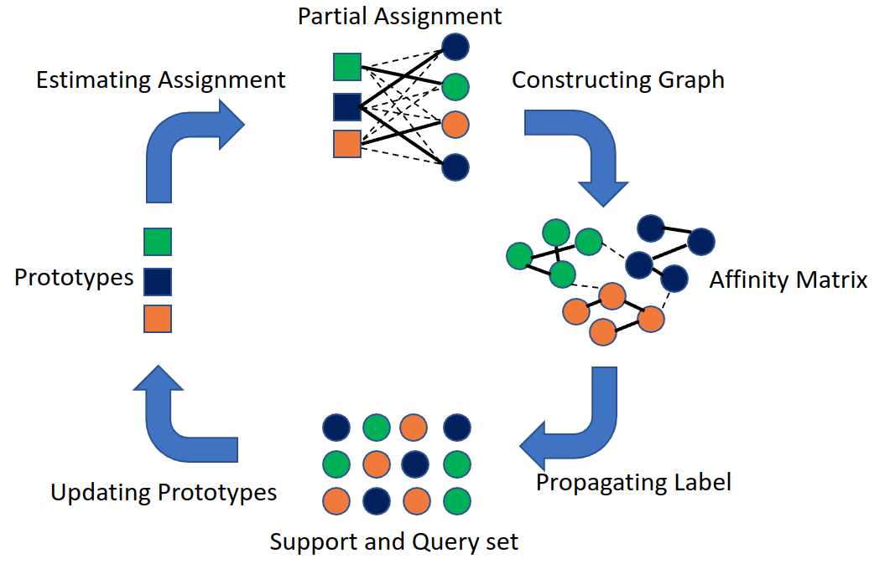

# protoLP

This page is for our paper in CVPR 2023 "Transductive Few-shot Learning with Prototype-based Label Propagation by Iterative Graph Refinement". I will update the code after NeurIPS DDL (LOL).

## usage
Please download features from [here](https://drive.google.com/file/d/1DHaCd0owzHHPEn_0Z3vfg15Q3slBJnLy/view?usp=sharing) and unzip it. This code can reproduce the performance in the paper, but something need to tune in different datasets like L2 normalization of prototypes.

There are three different files. I am still managing these. They are working for three different settings (w/o SK distance, with SK distance and unbalance setting). I think I still need a few days to check these codes. Sorry for my late release and thanks for your patient.

If there is anything confusing you, please let me know.

